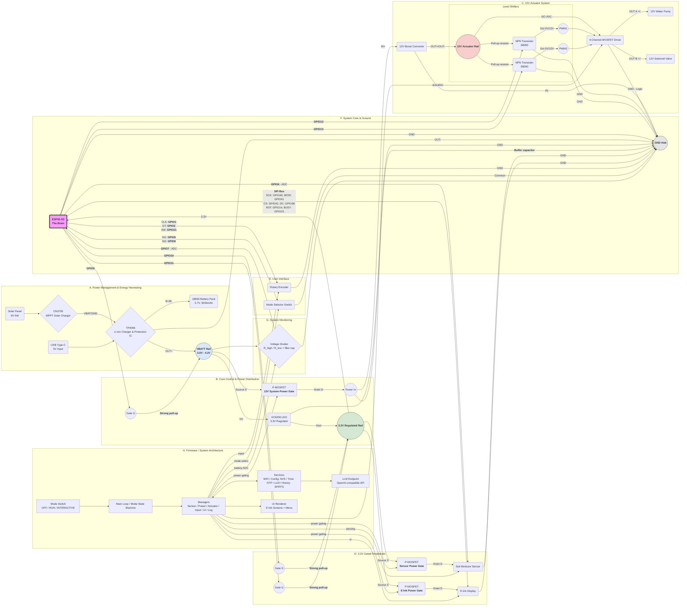

# 系统-硬件总览图（Mermaid）

> 用途：表达系统模块关系（固件视角）与硬件连接/电源域（模块级）。

```mermaid
graph LR

    %% =============================================================
    %% Combined diagram: System architecture + hardware wiring (module-level)
    %% Source of truth: firmware pin map in src/hal/hal_config.h
    %% =============================================================

    subgraph F [F. System Core & Ground]
        MCU(<b>ESP32-S3<br>The Brain</b>)
        style MCU fill:#f9f,stroke:#333,stroke-width:4px;

        GND((<b>GND Hub</b>))
        style GND fill:#e5e5e5,stroke:#333;

        MCU -- "GND" --> GND;
    end

    subgraph A [A. Power Management & Energy Harvesting]
        A1(Solar Panel<br>9V 5W) --> A2{CN3795<br>MPPT Solar Charger};
        A2 -- "VBAT/GND" --> A3;
        A4(USB Type-C<br>5V Input) --> A3{TP4056<br>Li-Ion Charger & Protection IC};
        A3 -- "B+/B-" --> A5(18650 Battery Pack<br>3.7V, 5000mAh);
        A3 -- "OUT+" --> B1;
        A3 -- "OUT-" --> GND;
    end

    subgraph B [B. Core Control & Power Distribution]
        B1((<b>VBATT Rail<br>3.0V - 4.2V</b>));
        style B1 fill:#dae8fc,stroke:#333;
        
        B1 -- "Vin" --> B2(XC6206 LDO<br>3.3V Regulator);
        B2 -- "GND" --> GND;
        B2 -- "Vout" --> B3((<b>3.3V Regulated Rail</b>));
        style B3 fill:#d5e8d4,stroke:#333;
        
        B3 -- "3.3V" --> MCU;
        
        B1 -- "Source S" --> B4(P-MOSFET<br><b>12V System Power Gate</b>);
        MCU -- "<b>GPIO9</b>" --> B4_G((Gate G));
        B4_G -- "<b>Strong pull-up</b>" --> B1;
        B4 -- "Drain D" --> C2_IN((Power In));
    end

    subgraph C [C. 12V Actuator System]
        C2_IN -- "IN+" --> C2(12V Boost Converter);
        C2_IN -- "<b>Buffer capacitor</b>" --> GND;
        C2 -- "IN-" --> GND;

        C2 -- "OUT+/OUT-" --> C3((<b>12V Actuator Rail</b>));
        style C3 fill:#f8cecc,stroke:#333;

        C3 -- "DC+/DC-" --> C4(4-Channel MOSFET Driver);
        C4 -- "GND - Logic" --> GND;
        
        subgraph C_DRIVERS [Level Shifters]
            MCU -- "<b>GPIO12</b>" --> C_D1(NPN Transistor<br>S8050);
            C3 -- "Pull-up resistor" --> C_D1;
            C_D1 -- "Out 0V/12V" --> C4_PWM1((PWM1));
            C_D1 -- "GND" --> GND;

            MCU -- "<b>GPIO13</b>" --> C_D2(NPN Transistor<br>S8050);
            C3 -- "Pull-up resistor" --> C_D2;
            C_D2 -- "Out 0V/12V" --> C4_PWM2((PWM2));
            C_D2 -- "GND" --> GND;
        end

        C4_PWM1 --> C4;
        C4_PWM2 --> C4;

        C4 -- "OUT A +/-" --> C5(12V Water Pump);
        C4 -- "OUT B +/-" --> C6(12V Solenoid Valve);
    end

    subgraph D [D. 3.3V Gated Peripherals]
        B3 -- "Source S" --> D1(P-MOSFET<br><b>Sensor Power Gate</b>);
        MCU -- "<b>GPIO10</b>" --> D1_G((Gate G));
        D1_G -- "<b>Strong pull-up</b>" --> B3;
        D1 -- "Drain D" --> D2(Soil Moisture Sensor);
        MCU -- "<b>GPIO4</b> - ADC" --> D2;
        D2 -- "GND" --> GND;

        B3 -- "Source S" --> D3(P-MOSFET<br><b>E-Ink Power Gate</b>);
        MCU -- "<b>GPIO11</b>" --> D3_G((Gate G));
        D3_G -- "<b>Strong pull-up</b>" --> B3;
        D3 -- "Drain D" --> D4(E-Ink Display);
        MCU -- "<b>SPI Bus</b><br>SCK: GPIO40, MOSI: GPIO41<br>CS: GPIO42, DC: GPIO38<br>RST: GPIO14, BUSY: GPIO15" --> D4;
        D4 -- "GND" --> GND;
    end

    subgraph E [E. User Interface]
        MCU -- "CLK: <b>GPIO1</b><br>DT: <b>GPIO2</b><br>SW: <b>GPIO21</b>" --> E1(Rotary Encoder);
        E1 -- "GND" --> GND;
        MCU -- "IN1: <b>GPIO5</b><br>IN2: <b>GPIO6</b>" --> E2(Mode Selector Switch);
        E2 -- "Common" --> GND;
    end

    subgraph G [G. System Monitoring]
        B1 -- " " --> G1{Voltage Divider<br>R_high / R_low + filter cap};
        G1 -- "<b>GPIO7</b> - ADC" --> MCU;
        G1 -- " " --> GND;
    end

    subgraph H [H. Firmware / System Architecture]
        H0[Mode Switch<br>OFF / RUN / INTERACTIVE]
        H1[Main Loop / Mode State Machine]
        H2[Managers<br>Sensor / Power / Actuator / Input / UI / Log]
        H3[Services<br>WiFi / Config: NVS / Time: NTP / LLM / History: SPIFFS]
        H4[UI Renderer<br>E-Ink Screens + Menu]
        H5[LLM Endpoint<br>OpenAI-compatible API]

        H0 --> H1 --> H2
        H2 <--> H3
        H2 --> H4
        H3 --> H5
    end

    %% Firmware-to-hardware bindings (conceptual)
    H2 -->|power gating| B4
    H2 -->|power gating| D1
    H2 -->|power gating| D3
    H2 -->|sensing| D2
    H2 -->|battery ADC| G1
    H2 -->|actuation| C4
    H2 -->|ui| D4
    H2 -->|input| E1
    H2 -->|mode select| E2
```
