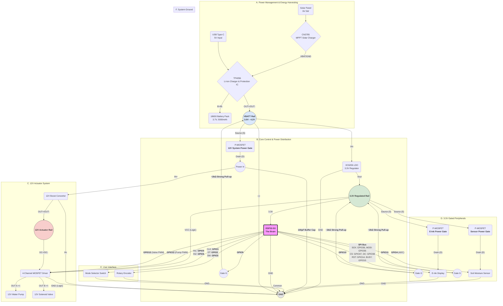

```mermaid
graph TD
    subgraph A [A. Power Management & Energy Harvesting]
        A1(Solar Panel<br>9V 5W) --> A2{CN3795<br>MPPT Solar Charger};
        A2 -- "VBAT/GND" --> A3;
        A4(USB Type-C<br>5V Input) --> A3{TP4056<br>Li-Ion Charger & Protection IC};
        A3 -- "B+/B-" --> A5(18650 Battery Pack<br>3.7V, 5000mAh);
        A3 -- "OUT+/OUT-" --> B1;
    end

    subgraph B [B. Core Control & Power Distribution]
        B1((<b>VBATT Rail<br>3.0V - 4.2V</b>));
        style B1 fill:#dae8fc,stroke:#333;
        
        B1 -- "Vin" --> B2(XC6206 LDO<br>3.3V Regulator);
        B2 -- "GND" --> F1;
        B2 -- "Vout" --> B3((<b>3.3V Regulated Rail</b>));
        style B3 fill:#d5e8d4,stroke:#333;
        
        B3 -- "3.3V" --> C1;
        
        B1 -- "Source (S)" --> B4(P-MOSFET<br><b>12V System Power Gate</b>);
        C1 -- "<b>GPIO9</b>" --> B4_G((Gate G));
        B4_G -- "<b>~2kΩ Strong Pull-up</b>" --> B1;
        B4 -- "Drain (D)" --> C2_IN((Power In));
    end

    subgraph C [C. 12V Actuator System]
        C2_IN -- "IN+" --> C2(12V Boost Converter);
        C2_IN -- "<b>100µF Buffer Cap</b>" --> F1;
        C2 -- "IN-" --> F1;

        C2 -- "OUT+/OUT-" --> C3((<b>12V Actuator Rail</b>));
        style C3 fill:#f8cecc,stroke:#333;

        C3 -- "DC+/DC-" --> C4(4-Channel MOSFET Driver);
        B3 -- "VCC (Logic)" --> C4;
        C4 -- "GND (Logic)" --> F1;
        
        C1 -- "<b>GPIO12</b> (Pump PWM)" --> C4;
        C1 -- "<b>GPIO13</b> (Valve PWM)" --> C4;

        C4 -- "OUT A +/-" --> C5(12V Water Pump);
        C4 -- "OUT B +/-" --> C6(12V Solenoid Valve);
    end

    subgraph D [D. 3.3V Gated Peripherals]
        B3 -- "Source (S)" --> D1(P-MOSFET<br><b>Sensor Power Gate</b>);
        C1 -- "<b>GPIO10</b>" --> D1_G((Gate G));
        D1_G -- "<b>~2kΩ Strong Pull-up</b>" --> B3;
        D1 -- "Drain (D)" --> D2(Soil Moisture Sensor);
        C1 -- "<b>GPIO4</b> (ADC)" --> D2;
        D2 -- "GND" --> F1;

        B3 -- "Source (S)" --> D3(P-MOSFET<br><b>E-Ink Power Gate</b>);
        C1 -- "<b>GPIO11</b>" --> D3_G((Gate G));
        D3_G -- "<b>~2kΩ Strong Pull-up</b>" --> B3;
        D3 -- "Drain (D)" --> D4(E-Ink Display);
        C1 -- "<b>SPI Bus</b><br>SCK: GPIO36, MOSI: GPIO35<br>CS: GPIO37, DC: GPIO38<br>RST: GPIO14, BUSY: GPIO15" --> D4;
        D4 -- "GND" --> F1;
    end

    subgraph E [E. User Interface]
        C1 -- "CLK: <b>GPIO1</b><br>DT: <b>GPIO2</b><br>SW: <b>GPIO3</b>" --> E1(Rotary Encoder);
        E1 -- "GND" --> F1;
        C1 -- "IN1: <b>GPIO5</b><br>IN2: <b>GPIO6</b>" --> E2(Mode Selector Switch);
        E2 -- "Common" --> F1;
    end

    subgraph F [F. System Ground]
        C1(<b>ESP32-S3<br>The Brain</b>);
        style C1 fill:#f9f,stroke:#333,stroke-width:4px;
        C1 -- "GND" --> F1((<b>GND</b>));
        style F1 fill:#e5e5e5,stroke:#333;
        B1 -- "(-)" --> F1;
    end
```